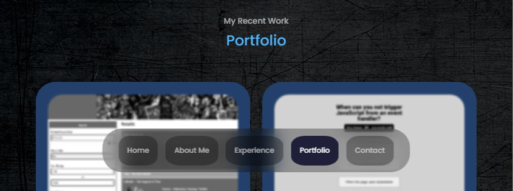
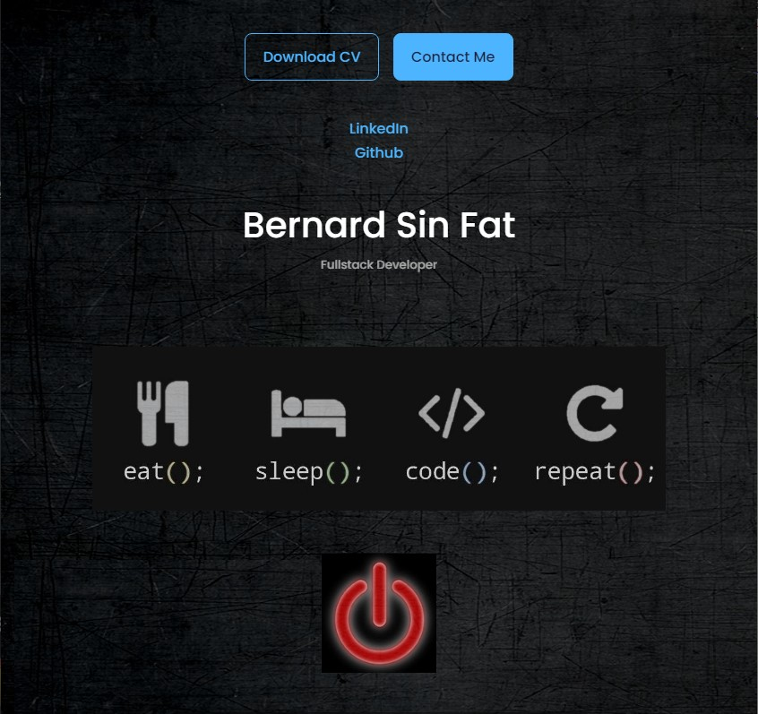
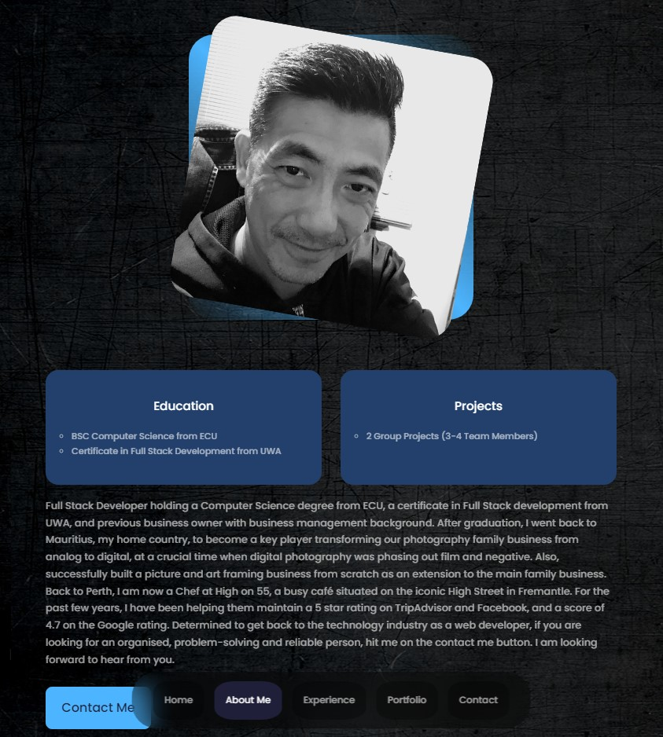
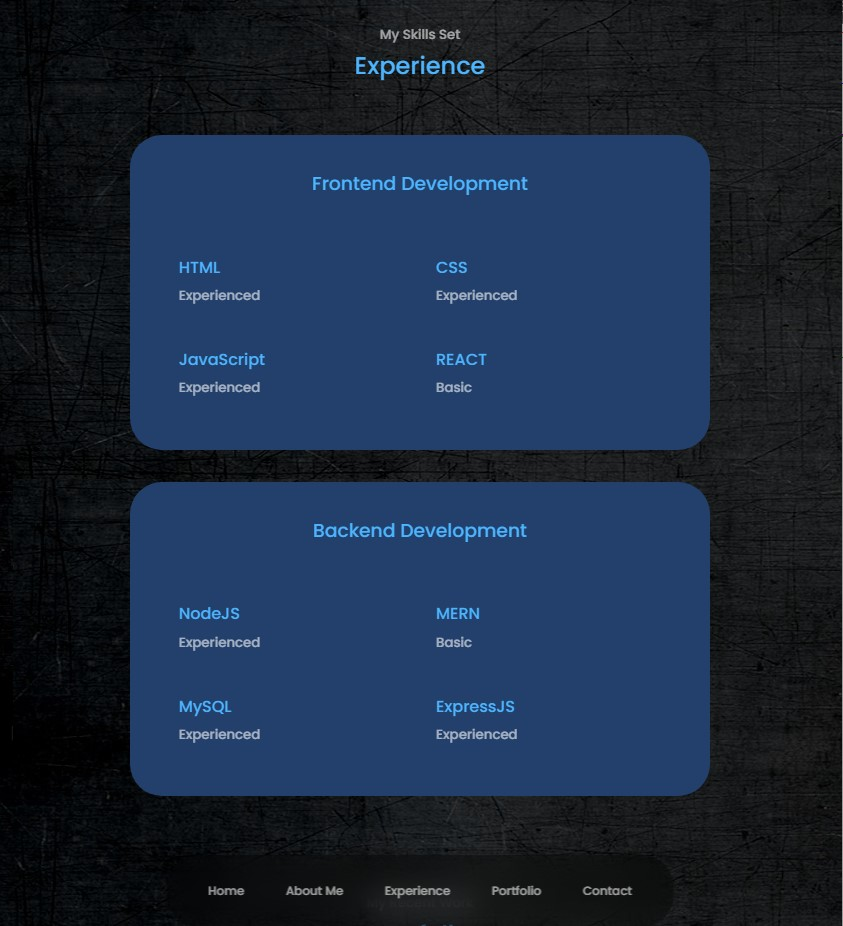
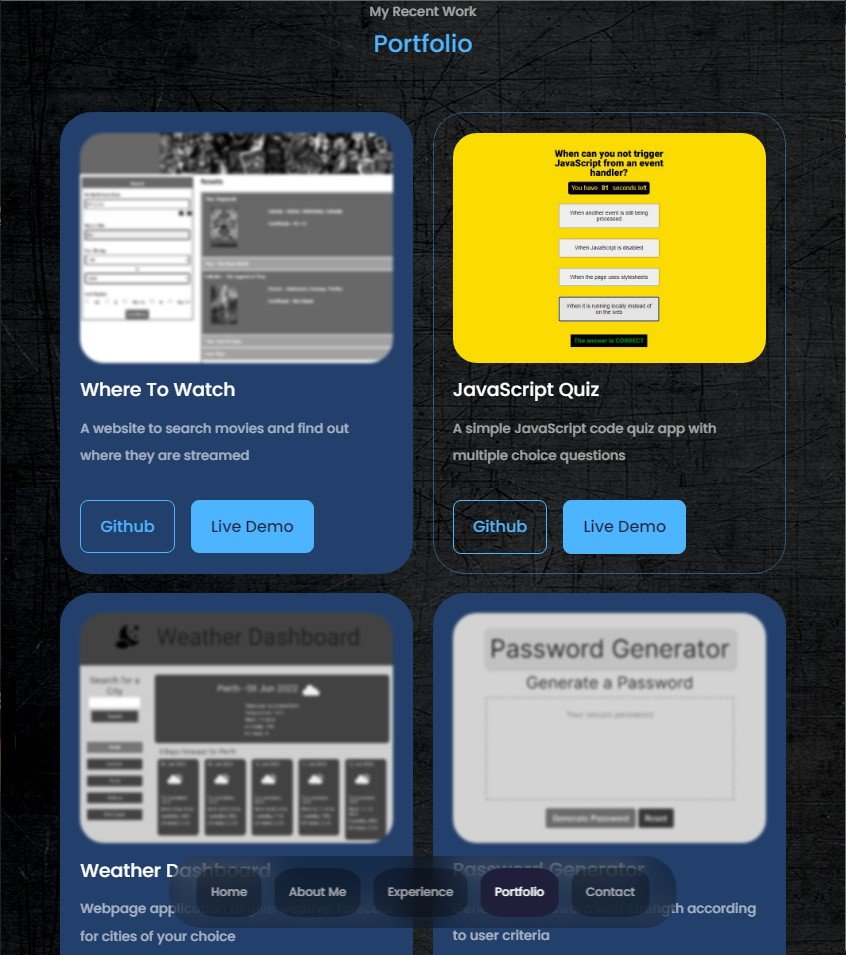
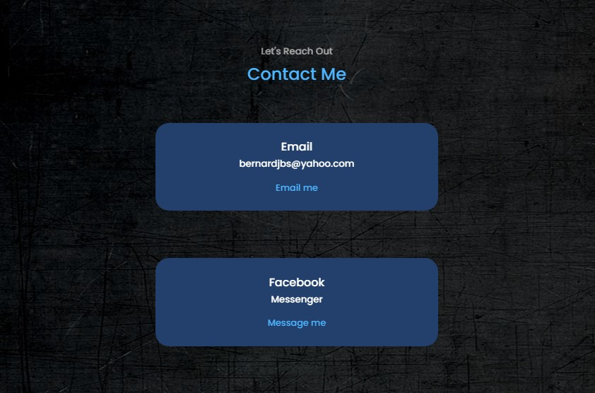

# Bernard Sin Fat's Portfolio

## The Website
This is a complete makeover from my [previous portfolio website](https://bernardjbs.github.io/hw-boot-wk02-professional_portfolio/). This new portfolio has more contents and improved css styles. The content is divided in to the following sections: 

- Navigation bar
- Header
- About Me
- Experience
- Portfolio
- Contact

## Navigation bar
- A fixed navigation bar which has anchored links to Home, About Me, Experience, Portfolio and Contact

## Header
The header contains 
- Options to download my CV as pdf and a button to anchor link to my contact details. 
- A social link section to my Github and LinkedIn
- My name and title
- A hero image animated with CSS and JavaScript 
- An image button to start and stop the animation

## About me
The about me section contains
- My profile picture with hover effect
- A description about myself
- Cards about my education and recent projects with hover effect
- A button anchored to my contacts link

## Experience
This section has two cards with hover effects, stating my experiences in frontend and backend developmennt. 

## Portfolio
My recent applications and projects can be viewed in this section. Each portfolio has a hover effect card which contains an image, a short description, a link to the github repository and a link to the live demo. 

## Contact
Contains two cards with hover effect with options to email me or send me a message on facebook messenger.

The website is responsive with medium and small devices with maximum width of 1024px and 600px respectively

## Link to deployed webpage
https://bernardjbs.github.io/hw-boot-wk08-Updated-Portfolio/